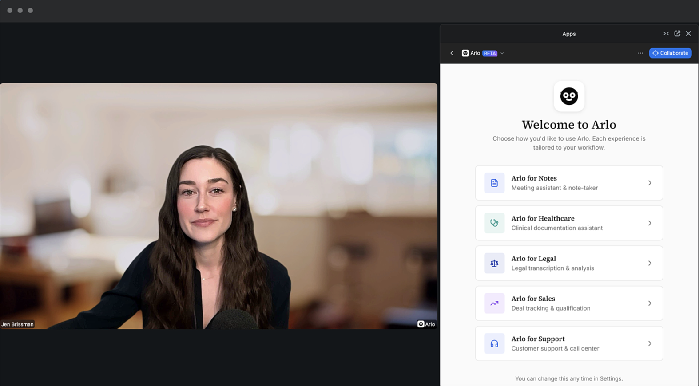
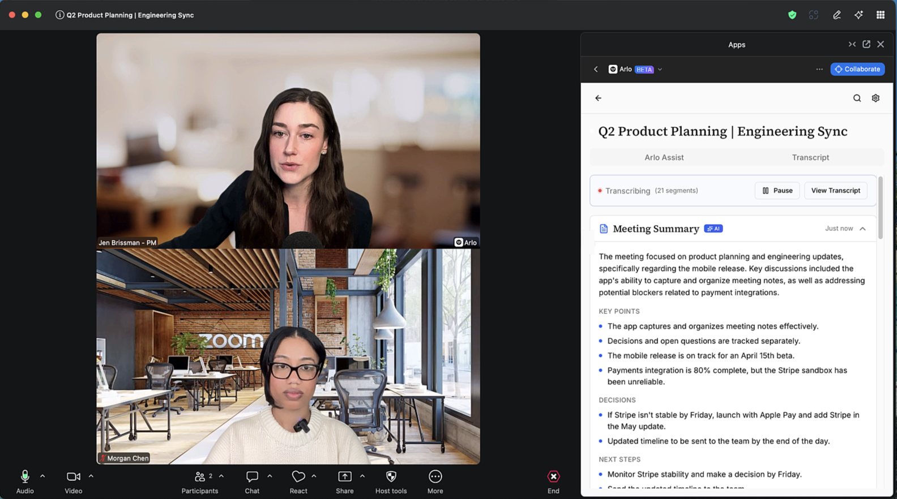
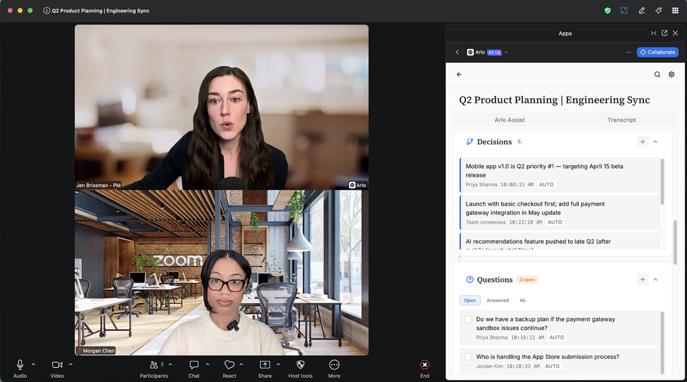
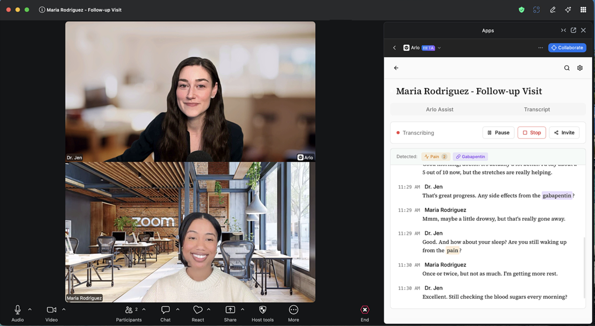
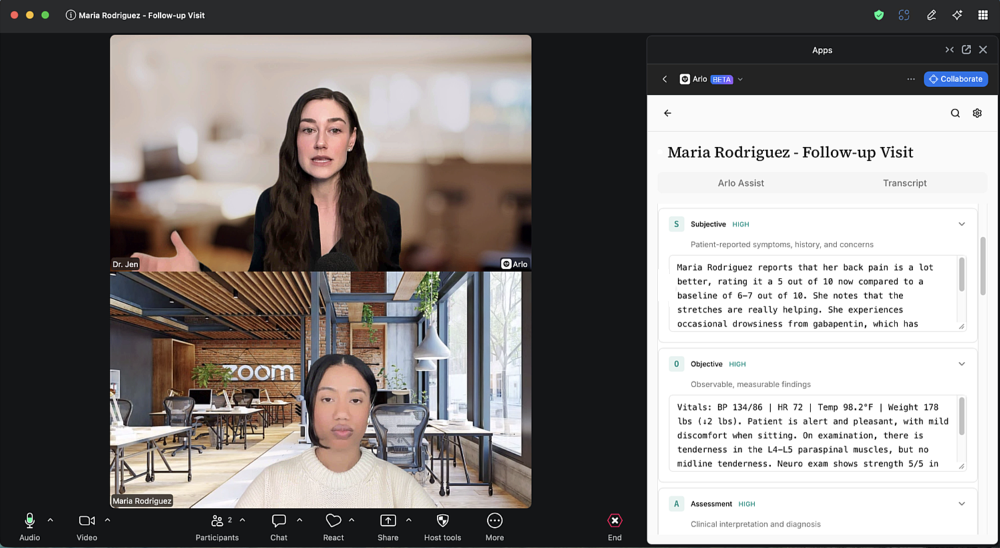
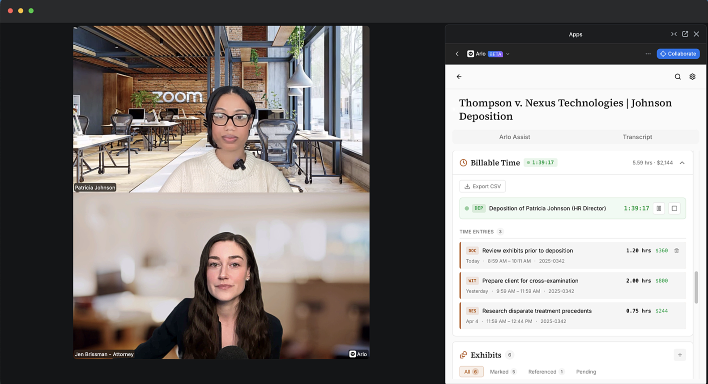
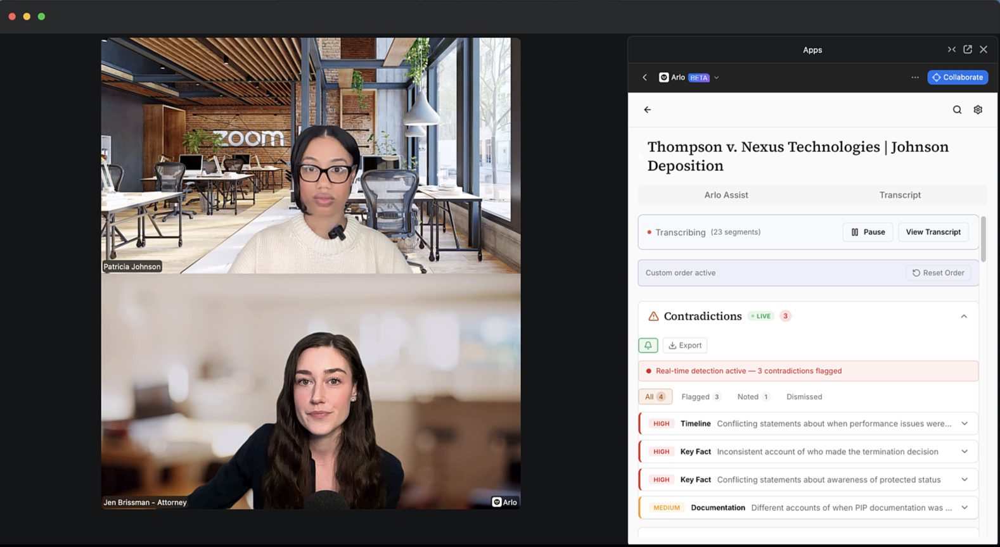
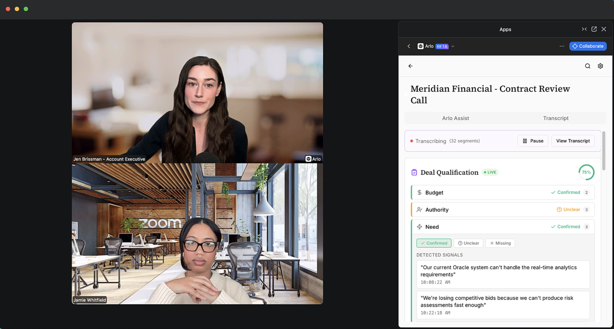
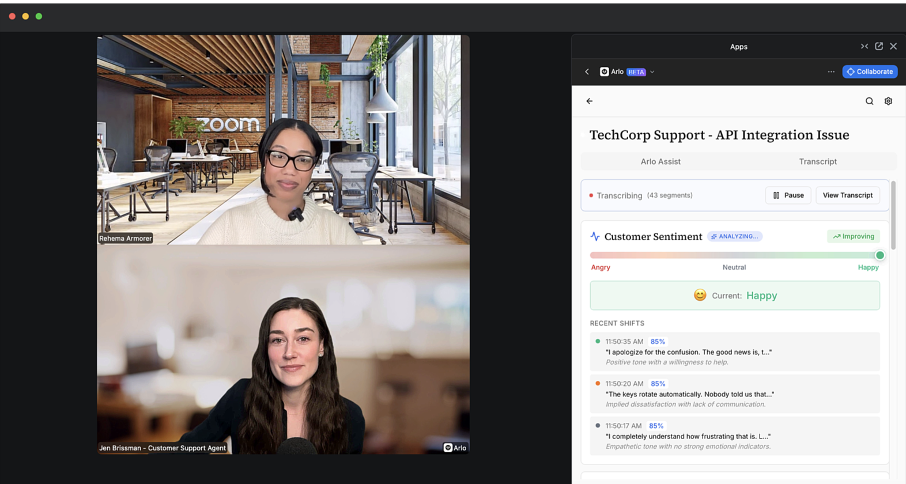

<div align="center">


# Arlo Meeting Assistant

**Build Real-Time Meeting Intelligence with Zoom RTMS**

[](./LICENSE)
[](https://nodejs.org/)
[](https://www.zoom.com/en/realtime-media-streams/)

[Get Started](#-quick-start) · [See Demos](#-see-it-in-action) · [Features](#-features) · [Troubleshooting](#-troubleshooting)

</div>

---

## What is Arlo?

Arlo is an **open-source reference implementation** that demonstrates the power of Zoom's RTMS (Real-Time Media Streams) APIs. It shows developers how to build meeting assistants that capture **live transcripts without requiring a bot in the meeting**.

<table>
<tr>
<td width="50%">

### Use This Project To

- **Learn** how RTMS webhooks, WebSockets, and transcript streaming work
- **Fork and customize** for your specific use case
- **Prototype** meeting intelligence applications
- **Understand** Zoom Apps authentication and best practices

</td>
<td width="50%">

### What You'll Build

- Live transcription with < 1 second latency
- AI-powered summaries and action items
- Full-text search across meetings
- Industry-specific modes (Healthcare, Legal, Sales)

</td>
</tr>
</table>

> **Note:** This is a starting point for developers. The industry verticals are illustrative examples showing what's possible with RTMS.

---

## See It In Action

<div align="center">



*Choose your workflow — each vertical is tailored to your industry*

### Video Demos

| Healthcare | Sales | Support |
|:----------:|:-----:|:-------:|
| [](https://youtu.be/F496oIqo6ls) | [](https://youtu.be/LKpZAe5_A8o) | [](https://youtu.be/1N6hs88nOhA) |
| [Watch Demo](https://youtu.be/F496oIqo6ls) | [Watch Demo](https://youtu.be/LKpZAe5_A8o) | [Watch Demo](https://youtu.be/1N6hs88nOhA) |

| Legal | Notes |
|:-----:|:-----:|
| [](https://youtu.be/WNM5YxRTrIU) | [](https://youtu.be/4N-g5TgGRz0) |
| [Watch Demo](https://youtu.be/WNM5YxRTrIU) | [Watch Demo](https://youtu.be/4N-g5TgGRz0) |

</div>

---

## Features

| Feature | Description |
|---------|-------------|
| **Live Transcription** | Real-time captions via RTMS (< 1 second latency) |
| **Voice Commands** | Say "Arlo, summarize" or "Arlo, action items" during meetings |
| **AI Insights** | Summaries, action items, and next steps powered by OpenRouter |
| **Full-Text Search** | Search across all your meeting transcripts instantly |
| **Chat with Transcripts** | Ask questions about your meetings using AI |
| **Meeting Highlights** | Create bookmarks with timestamps for key moments |
| **Export Options** | Download WebVTT files or Markdown summaries |
| **Dark Mode** | Automatic OS detection with manual toggle |
| **Industry Verticals** | Specialized modes: Arlo for Notes, Healthcare, Legal, Sales, and Support |

> **AI features work out of the box** — no API key required! Arlo uses [OpenRouter](https://openrouter.ai/) with free models (Gemini, Llama). Optional: add your own `OPENROUTER_API_KEY` for higher rate limits.

---

## Voice Commands

Control Arlo hands-free during meetings. Just say the wake word followed by a command:

| Command | What It Does |
|---------|--------------|
| "Arlo, summarize" | Generate a meeting summary |
| "Arlo, action items" | Extract action items and to-dos |
| "Arlo, highlight this" | Create a bookmark at the current moment |
| "Arlo, decisions" | Show key decisions made |
| "Arlo, questions" | Show open/unanswered questions |
| "Arlo, send to chat" | Send summary to meeting chat |
| "Arlo, help" | Show available commands |

**Alternate wake words:** "Hey Arlo", "Hi Arlo"

Responses appear inline in the meeting view. You can toggle response visibility in Settings.

---

## Settings

Access settings via the gear icon in the app. Available options:

### Transcription

| Setting | Description |
|---------|-------------|
| **Auto-open in meetings** | Automatically open Arlo when you join scheduled meetings |
| **Auto-start transcription** | Begin transcription immediately when the app opens |

### Demo Mode

| Setting | Description |
|---------|-------------|
| **Show sample data** | Display example data to demonstrate features. Turn off to only see real meeting data. |

### Chat Notifications

| Setting | Description |
|---------|-------------|
| **Enable Chat Notifications** | Send automatic messages to Zoom chat when transcription events occur |
| **Event toggles** | Choose which events trigger notifications (start, pause, resume, stop, restart) |
| **Message templates** | Customize the message text for each event. Use `[meeting-id]` as a placeholder. |

### Voice Commands

| Setting | Description |
|---------|-------------|
| **Show Arlo Responses** | Display voice command responses in the meeting view. Turn off for cleaner demos. |

### Developer Tools

| Setting | Description |
|---------|-------------|
| **Start/Stop via REST API** | Test RTMS control using Zoom's participant REST API instead of the client SDK. Useful for automation and testing. |

### AI Configuration

| Setting | Description |
|---------|-------------|
| **AI Provider** | Choose between OpenRouter (default, free), Anthropic, OpenAI, or Custom |
| **API Key** | Your API key (stored locally, never sent to Arlo's servers) |
| **Model** | Select which AI model to use for summaries and insights |

---

## Prerequisites

Before you begin, ensure you have:

| Requirement | Why You Need It |
|-------------|-----------------|
| **[Node.js 20+](https://nodejs.org/)** | Runtime for backend services |
| **[Docker Desktop](https://www.docker.com/products/docker-desktop/)** | Runs MySQL and all services |
| **[ngrok](https://ngrok.com/)** | Creates secure tunnels for Zoom webhooks |
| **[Zoom Account](https://marketplace.zoom.us/)** | To create and configure your Zoom App |

### RTMS Access Required

> **This app requires RTMS access from Zoom.** RTMS (Real-Time Media Streams) enables live transcript streaming.
>
> **[Request RTMS Access](https://www.zoom.com/en/realtime-media-streams/#form)** — Apply early, approval may take a few days.

---

## Quick Start

### 1. Clone & Set Up ngrok

```bash
# Clone the repository
git clone https://github.com/zoom/arlo.git
cd arlo
```

Start ngrok to create a public URL for Zoom webhooks:

```bash
# Option A: Static domain (recommended - free, doesn't change)
ngrok http 3000 --domain=your-name.ngrok-free.app

# Option B: Random domain (changes each restart)
ngrok http 3000
```

> **Tip:** Get a free static domain at [ngrok dashboard → Domains](https://dashboard.ngrok.com/domains) to avoid reconfiguring Zoom settings.

**Keep this terminal running** and note your URL (e.g., `https://your-name.ngrok-free.app`).

---

### 2. Create Your Zoom App

1. Go to **[Zoom Marketplace](https://marketplace.zoom.us/)** → Develop → Build App
2. Select **General App** → name it (e.g., "Arlo Meeting Assistant")
3. Copy your **Client ID** and **Client Secret**

---

### 3. Configure Environment

```bash
cp .env.example .env
```

Edit `.env` with your values:

```bash
# From Zoom Marketplace (Step 2)
ZOOM_CLIENT_ID=your_client_id
ZOOM_CLIENT_SECRET=your_client_secret

# Your ngrok URL (Step 1)
PUBLIC_URL=https://your-name.ngrok-free.app

# Generate secrets (run these commands, paste the output)
SESSION_SECRET=       # node -e "console.log(require('crypto').randomBytes(32).toString('hex'))"
REDIS_ENCRYPTION_KEY= # node -e "console.log(require('crypto').randomBytes(16).toString('hex'))"
```

---

### 4. Configure Zoom App Settings

In [Zoom Marketplace](https://marketplace.zoom.us/) → Your App:

<details>
<summary><strong>Basic Information</strong></summary>

| Setting | Value |
|---------|-------|
| OAuth Redirect URL | `https://YOUR-NGROK-URL/api/auth/callback` |
| OAuth Allow List | `https://YOUR-NGROK-URL` |

</details>

<details>
<summary><strong>Scopes</strong></summary>

Add these OAuth scopes:
- `meeting:read` — Read meeting details
- `user:read` — Read user profile

</details>

<details>
<summary><strong>Features → Zoom App SDK</strong></summary>

- Click **Add APIs** and enable required capabilities
- **Enable RTMS → Transcripts** (requires RTMS approval)

</details>

<details>
<summary><strong>Features → Surface</strong></summary>

| Setting | Value |
|---------|-------|
| Home URL | `https://YOUR-NGROK-URL` |
| Domain Allow List | `https://YOUR-NGROK-URL` |

</details>

<details>
<summary><strong>Features → Event Subscriptions</strong></summary>

| Setting | Value |
|---------|-------|
| Event notification endpoint | `https://YOUR-NGROK-URL/api/rtms/webhook` |
| Events to subscribe | `meeting.rtms_started`, `meeting.rtms_stopped` |

</details>

> Replace `YOUR-NGROK-URL` with your actual ngrok URL (e.g., `your-name.ngrok-free.app`)

---

### 5. Start the Application

```bash
docker-compose up --build
```

Wait for all services to start:
- MySQL database
- Backend API (port 3000)
- Frontend (port 3001)
- RTMS service (port 3002)

---

### 6. Test in Zoom

1. Start or join a Zoom meeting
2. Click **Apps** in the toolbar
3. Find and open your app
4. Click **"Start Arlo"** to begin transcription
5. Watch live transcripts appear in the **Transcript** tab
6. Switch to **Arlo Assist** to try AI features:
   - Generate meeting summaries
   - Extract action items
   - Ask questions about your meeting

---

## Industry Verticals

Arlo includes specialized modes demonstrating RTMS capabilities for different industries. Each vertical shows how real-time transcription can power domain-specific features.

### Arlo for Notes
**Full-Featured Note-Taking** — Meeting summaries, key decisions, action items, and open questions tracked automatically.

[](https://youtu.be/4N-g5TgGRz0)

<p align="center">


</p>

---

### Arlo for Healthcare
**Clinical Documentation** — SOAP notes auto-generation, medication and symptom detection, clinical terminology highlighting.

[](https://youtu.be/F496oIqo6ls)

<p align="center">


</p>

---

### Arlo for Legal
**Deposition Assistance** — Real-time contradiction detection, billable time tracking with export, and exhibit management.

[](https://youtu.be/WNM5YxRTrIU)

<p align="center">


</p>

---

### Arlo for Sales
**Deal Intelligence** — BANT qualification tracking (Budget, Authority, Need, Timeline), competitor mentions, and commitment detection.

[](https://youtu.be/LKpZAe5_A8o)

<p align="center">

</p>

---

### Arlo for Support
**Agent Assistance** — Live customer sentiment meter with trend analysis and emotional shift tracking.

[](https://youtu.be/1N6hs88nOhA)

<p align="center">

</p>

> **Building your own vertical?** Fork this repo and customize the frontend components in `frontend/src/features/` for your specific use case.

---

## Troubleshooting

<details>
<summary><strong>Database / Prisma Errors</strong></summary>

**"Cannot find module '.prisma/client'"**
```bash
docker-compose exec backend npx prisma generate
docker-compose restart backend
```

**"Can't reach database server"**
```bash
docker-compose restart mysql backend
```

**Tables don't exist**
```bash
docker-compose exec backend npx prisma db push
```

</details>

<details>
<summary><strong>Clean Restart</strong></summary>

If you're having persistent issues:

```bash
# Stop everything and remove volumes
docker-compose down -v

# Rebuild with fresh node_modules
docker-compose up --build -V
```

</details>

<details>
<summary><strong>ngrok Issues</strong></summary>

**App stops working after restarting ngrok?**

If using a random domain:
1. Copy the new ngrok URL
2. Update `PUBLIC_URL` in `.env`
3. Update all URLs in Zoom Marketplace settings
4. Restart: `docker-compose restart backend`

> **Pro tip:** Use a [static ngrok domain](https://dashboard.ngrok.com/domains) (free) to avoid this!

</details>

<details>
<summary><strong>More Help</strong></summary>

See the full [Troubleshooting Guide](./docs/TROUBLESHOOTING.md) for additional issues.

</details>

---

## Documentation

| Document | Description |
|----------|-------------|
| [Architecture](./docs/ARCHITECTURE.md) | System design and data flow |
| [Project Status](./docs/PROJECT_STATUS.md) | Roadmap and current progress |
| [Specification](./SPEC.md) | Feature spec and milestones |
| [Troubleshooting](./docs/TROUBLESHOOTING.md) | Common issues and fixes |
| [CLAUDE.md](./CLAUDE.md) | Quick reference for AI assistants |

---

## Development

### Project Structure

```
arlo/
├── backend/           # Express API server + Prisma ORM
├── frontend/          # React Zoom App (CRA)
├── rtms/              # RTMS transcript ingestion service
├── docs/              # Documentation
└── docker-compose.yml # Development environment
```

### Common Commands

```bash
docker-compose up                    # Start all services
docker-compose logs -f backend       # View backend logs
docker-compose restart backend       # Restart a service
docker-compose down -v               # Stop and remove volumes
npm run db:studio                    # Open Prisma database GUI
```

### Tech Stack

| Layer | Technology |
|-------|------------|
| Frontend | React 18, Zoom Apps SDK, Base UI |
| Backend | Node.js 20, Express, Prisma |
| Database | MySQL 8.0 |
| AI | OpenRouter (free models available) |
| Real-time | WebSocket + RTMS SDK |

---

## Contributing

This is an open-source starter kit designed to be forked and customized!

1. **Fork** this repository
2. **Customize** for your use case
3. **Share** improvements via pull request

### Ideas for Extension

- Multi-language transcription support
- Custom AI models (local LLMs)
- Team workspaces and sharing
- Calendar integration
- Video replay with transcript sync

---

## Zoom for Government

This application supports Zoom for Government (ZfG) deployments:

```bash
# In your .env file
ZOOM_HOST=zoomgov.com
```

1. Create your app in the [Zoom for Government Marketplace](https://marketplace.zoomgov.com/)
2. Use ZfG-specific URLs in your configuration

> **Note:** RTMS availability on ZfG may differ. Contact your Zoom representative for ZfG-specific access.

---

## Production Deployment

### Deploy to Render (One-Click)

The easiest way to deploy Arlo to production is with [Render](https://render.com/):

[](https://render.com/deploy?repo=https://github.com/zoom/arlo)

This deploys all services (backend, frontend, RTMS, MySQL) with automatic secret generation. After deployment:

1. Add your Zoom credentials in the Render dashboard:
   - `ZOOM_CLIENT_ID`
   - `ZOOM_CLIENT_SECRET`
   - `ZOOM_WEBHOOK_TOKEN`
2. Update your Zoom App settings with the Render URLs
3. That's it — you're live!

See [`render.yaml`](./render.yaml) for the full infrastructure configuration.

---

### Production Considerations

This reference implementation is designed for **learning and prototyping**. Before production deployment:

| Area | Development | Production Recommendation |
|------|-------------|---------------------------|
| **Credentials** | `.env` file | Secrets manager (AWS, Vault, Azure) |
| **Tokens** | MySQL + AES | Add encryption at rest |
| **Sessions** | In-memory | Redis or database-backed |
| **HTTPS** | ngrok tunnel | Load balancer with TLS |
| **WebSockets** | Single instance | Redis pub/sub for scaling |

See [Known Limitations](#known-limitations) for additional considerations.

---

## Known Limitations

This is a reference implementation with intentional simplifications:

| Pattern | Current | Production Recommendation |
|---------|---------|---------------------------|
| PKCE Storage | In-memory Map | Redis with TTL |
| WebSocket Scaling | Single-instance | Redis pub/sub adapter |
| Retry Logic | Basic 401 retry | Exponential backoff |
| Webhook Processing | Synchronous | Queue-based async |
| Input Validation | Basic checks | Schema validation (Zod) |

---

## Resources

- [Zoom Apps Documentation](https://developers.zoom.us/docs/zoom-apps/)
- [RTMS Documentation](https://developers.zoom.us/docs/rtms/)
- [Zoom Apps SDK Reference](https://appssdk.zoom.us/classes/ZoomSdk.ZoomSdk.html)
- [OpenRouter API](https://openrouter.ai/docs)

---

## Support

- **Issues:** [GitHub Issues](https://github.com/zoom/arlo/issues)
- **Discussions:** [GitHub Discussions](https://github.com/zoom/arlo/discussions)
- **RTMS Access:** [Request Form](https://www.zoom.com/en/realtime-media-streams/#form)
- **Zoom Developer Forum:** [devforum.zoom.us](https://devforum.zoom.us/)

---

## License

MIT License — See [LICENSE](./LICENSE) for details.

---

<div align="center">

**Ready to build your own meeting assistant?**

[Get Started](#-quick-start) · [Star this repo](https://github.com/zoom/arlo)

</div>
